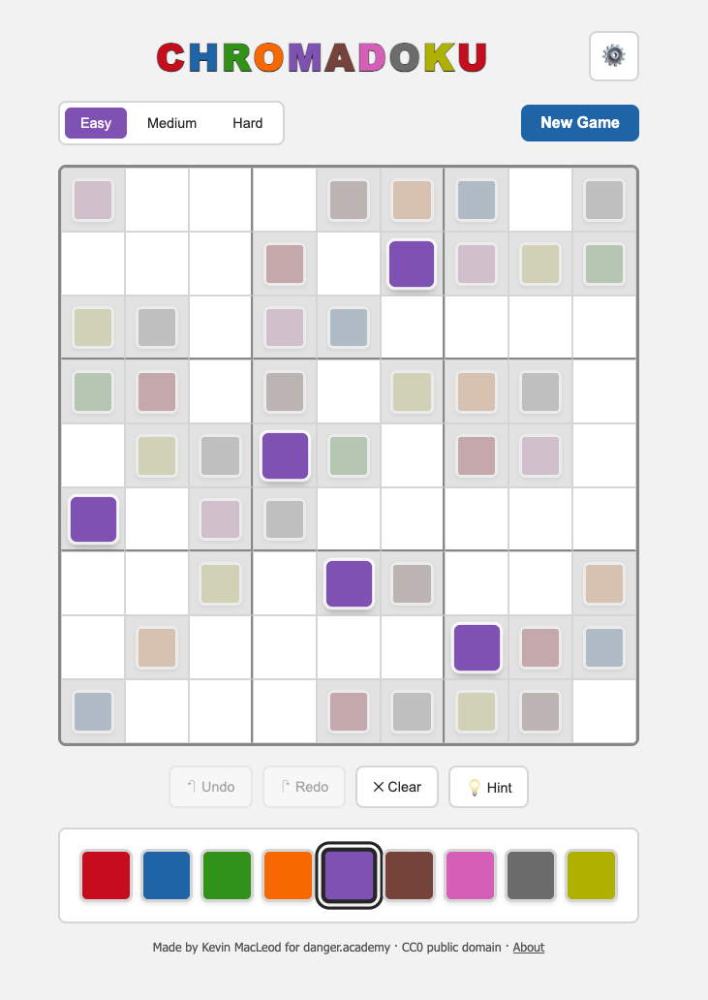

# Chromadoku

Sudoku with colors in place of numbers.

Play it: https://danger.academy/chromadoku/

## The game

The rules are Sudoku's: fill the 9x9 grid so that every row, every column, and
every 3x3 box contains each of the nine colors exactly once. Swapping digits for
hues changes how the puzzle feels. You stop counting and start seeing, and the
occasional near-miss between two similar colors is part of the fun.

Three difficulties (Easy, Medium, Hard), undo and redo, a hint button, and
per-difficulty statistics with best times for hint-free solves.

## Settings

- Theme: Light, System, or Dark.
- Colors: Default, Neon, or Candy palettes.
- Number badges: label every color 1 to 9, for when hues are hard to tell apart
  or for color-blind players.
- Sound on or off.
- Warn on mistakes: flash a square whose color does not match the solution.

Progress and settings are saved in your browser only. Nothing leaves your
machine.

## Running it

The whole game is `index.html`. Open it in any modern browser and it runs. No
build step, no dependencies, no network calls. To host it, copy the file to any
static web server.

## Desktop app

`Chromadoku-Electron/` wraps the same HTML file in an Electron shell with a
native menu (New Game, Undo, Redo, Clear, Hint, Settings), single-instance
lock, and persistent storage across updates. See its README for build steps for
macOS, Windows, and Linux.

## License

CC0 1.0 Universal. Public domain. Copy it, change it, ship it. No permission
needed, no credit required. See `LICENSE`.

Made by Kevin MacLeod for danger.academy.
